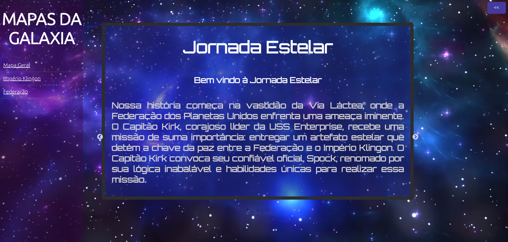
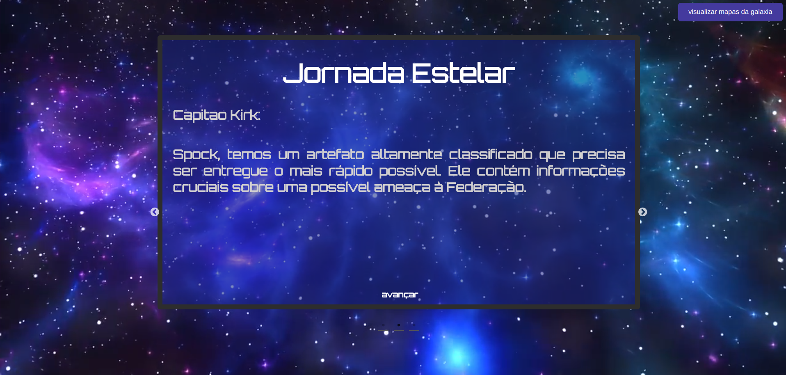
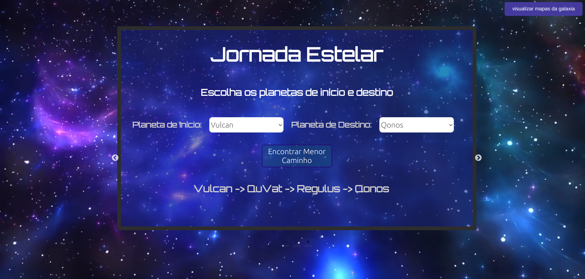
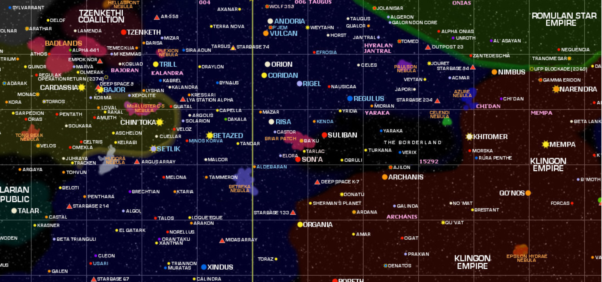

# Jornada Estelar

**Conteúdo da Disciplina**: Grafos 2<br>

## Alunos
|Matrícula | Aluno |
| -- | -- |
| 20/0018442  |  Gabrielly Assunção Rodrigues |
| 20/0023934|  Maria Eduarda Barbosa Santos |

### Apresentação

## Sobre

<p align="justify">
Nossa história começa na vastidão da Via Láctea, onde a Federação dos Planetas Unidos enfrenta uma ameaça iminente. O Capitão Kirk, corajoso líder da USS Enterprise, recebe uma missão de suma importância: entregar um artefato que detém a chave da paz entre a Federação e o Império Klingon. O Capitão Kirk convoca seu confiável oficial, Spock, renomado por sua lógica inabalável e habilidades únicas para realizar essa missão.</p>
<p align="justify">
Utilizando o algoritmo de Dijkstra é possível confeir o menor caminho feito por Spock para chegar até a Q’oNos, capital do Império Klingon. Também é possível visualizar  o menor  caminho entre outros planetas da galáxia.</p>

## Screenshots
**Imagem 1 - Tela Inicial** 



**Imagem 2 - História**



**Imagem 3 - Algoritmo**



**Imagem 4 - Mapa da Galáxia**



## Instalação 
**Linguagem**: JavaScript<br>
**Framework**: Node.js React.js<br>
### Pré-requisitos para rodar o sistema:

- Node.js versão v14.0.0 ou superior <br>
#### Passo 1

- Após a instação de todos os pŕe-requisitos, dentro da pasta backpacker utilize o comando:
  ```
  npm start
### Pronto, o projeto estará rodando!

## Uso 

<p align="justify">
A aplicação disponibiliza alguns planetas do universo de startrek, basta escolher os palnetas onde a viagem começa e termina, nossa aplicação disponibilizará o menor caminho entre eles.
</p>

## Outros 

> Referência:  <https://www.ussventure.eng.br/>.  Acesso em: 09 out. 2023.